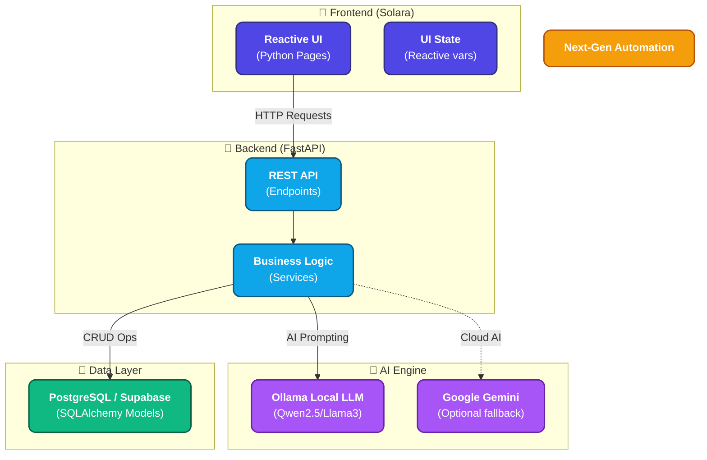
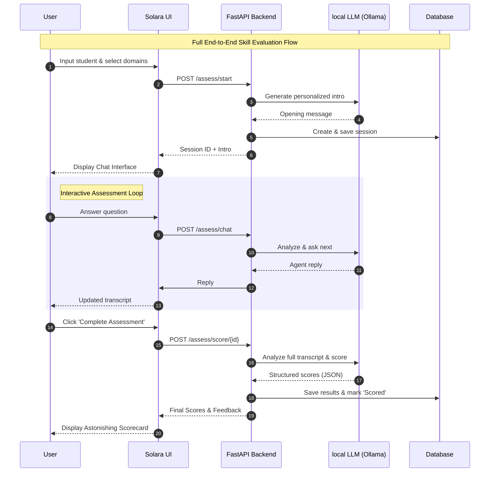

# 🧑‍🤝‍🧑 Group Maker

> An AI-powered platform to manage members, run skill assessments, and evaluate GitHub repositories — built with **FastAPI** + **Solara**.

---

## ✨ Features

| Feature | Description |
|---|---|
| 👥 **Member Management** | Add individual or bulk members and assign them to skill domains |
| 📝 **AI Assessment** | Run interactive, AI-driven skill assessments powered by a local LLM (Ollama) |
| 🧑‍⚖️ **Repo Judge** | Evaluate GitHub repositories and get AI feedback on code quality |

---

## 🏗️ Project Structure

```
group_maker/
├── backend/
│   └── app/
│       ├── main.py          # FastAPI entry point
│       ├── models.py        # SQLAlchemy DB models (Member, Domain, AssessmentSession)
│       ├── schemas.py       # Pydantic schemas
│       ├── crud.py          # Database helpers
│       ├── database.py      # DB connection (SQLAlchemy + PostgreSQL)
│       ├── routers/
│       │   ├── members.py   # CRUD endpoints for members & domains
│       │   ├── assessment.py# AI assessment session endpoints
│       │   └── repo_judge.py# GitHub repo evaluation endpoint
│       └── services/        # Business logic / AI service wrappers
├── solara_app/
│   ├── app.py               # Solara app layout & routing
│   └── pages/
│       ├── members.py       # Members UI page
│       ├── assessment.py    # Assessment UI page
│       └── repo_judge.py    # Repo Judge UI page
├── requirements.txt
├── render.yaml              # Render.com deployment config
└── .env                     # Environment variables (not committed)
```

---

## 🏛️ Technical Architecture



---

## 🔄 Feature Workflow



---

---

## ⚙️ Tech Stack

- **Backend**: FastAPI, SQLAlchemy, PostgreSQL (Supabase)
- **Frontend**: Solara (Python-native reactive UI)
- **AI**: Ollama (local LLM — `qwen2.5:3b` by default), LangChain Google GenAI
- **Deployment**: Render.com (Blueprint via `render.yaml`)

---

## 🚀 Getting Started (Local)

### 1. Clone the repo

```bash
git clone https://github.com/keshavmishra27/group_maker.git
cd group_maker
```

### 2. Install dependencies

```bash
pip install -r requirements.txt
```

### 3. Configure environment variables

Create a `.env` file in the project root:

```env
DATABASE_URL=postgresql://<user>:<password>@<host>:5432/<db>
OLLAMA_MODEL=qwen2.5:3b
OLLAMA_BASE_URL=http://localhost:11434
API_URL=http://localhost:8000
```

### 4. Pull the Ollama model

Make sure [Ollama](https://ollama.com/) is installed and running, then pull the model:

```bash
ollama pull qwen2.5:3b
```

### 5. Run the FastAPI backend

```bash
uvicorn backend.app.main:app --reload
```

API will be available at: `http://localhost:8000`  
Interactive docs: `http://localhost:8000/docs`

### 6. Run the Solara frontend

```bash
solara run solara_app/app.py
```

Frontend will be available at: `http://localhost:8765`

---

## 📡 API Endpoints

### Members
| Method | Endpoint | Description |
|---|---|---|
| `GET` | `/members/` | List all members |
| `GET` | `/members/domains` | List all domains |
| `GET` | `/members/by-domain` | Members grouped by domain |
| `POST` | `/members/` | Create a single member |
| `POST` | `/members/bulk` | Create multiple members at once |
| `PUT` | `/members/{id}` | Update a member |
| `DELETE` | `/members/{id}` | Delete a member |

### Assessment
| Method | Endpoint | Description |
|---|---|---|
| `POST` | `/assessment/start` | Start a new AI assessment session |
| `POST` | `/assessment/message` | Send a message in an active session |
| `POST` | `/assessment/complete` | Complete session & get scores |

### Repo Judge
| Method | Endpoint | Description |
|---|---|---|
| `POST` | `/repo-judge/` | Submit a GitHub repo URL for AI evaluation |

---

## ☁️ Deployment (Render)

This project includes a `render.yaml` for one-click deployment via [Render Blueprints](https://render.com/docs/blueprint-spec).

Two services are deployed:
- **`group-maker-api`** → FastAPI backend
- **`group-maker-ui`** → Solara frontend

Set the following environment variables manually in the Render dashboard:
- `DATABASE_URL`
- `OPENAI_API_KEY` *(if used)*
- `VAPI_API_KEY` / `VAPI_PHONE_NUMBER_ID` / `WEBHOOK_URL` *(if using Vapi calling agent)*

---

## 🗄️ Database Models

- **`Member`** — name, category, linked domains
- **`Domain`** — skill domain (e.g. AI, Web Dev)
- **`MemberDomain`** — many-to-many join table
- **`AssessmentSession`** — student name, domains tested, transcript, scores, status

---
