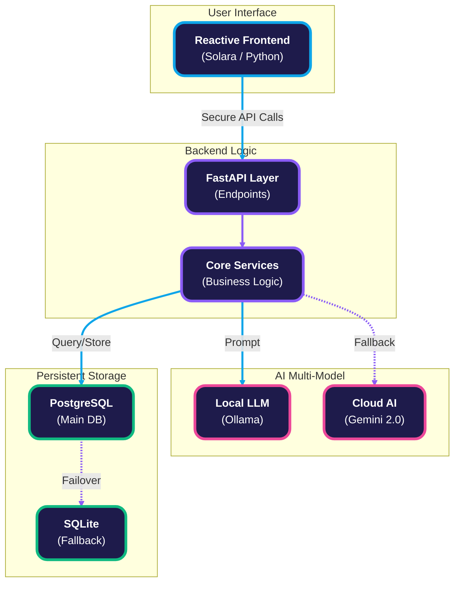

#  Groupify

> Groupify is a platform which solves the  tedious task of doing the SWOT analysis of your project as well your idea.It also  let you analyse your coding style along with telling you how much ahead  you are as compared to another developers.


---

##  Features

| Feature | Description |
|---|---|
| **Idea Refiner** | patent level gap analysis, novelty scoring (0-100), and technical refinement options |
|  **Repo Judge** | Submit any GitHub repo URL and our AI performs deep codebase analysis and delivers a hackathon style verdict with mentor feedback |
|  **Project Suggestion** | get project suggestion for hackathons and your resume on the basis of your intrest.  |
|  **Coder comparison** | takes your quiz and on  the basis of it compares you with developers worldwide |




---

## Feature Workflow

```mermaid
sequenceDiagram
    autonumber
    
    %% Premium Participants
    participant U as  User
    participant S as  Solara UI
    participant F as  FastAPI
    participant A as  AI Engine
    participant D as  Database

    Note over U,D:  End-to-End Worldwide Comparison (Quiz) Flow 

    U->>+S: Select Domain for Quiz
    S->>+F: POST /assess/generate-mcq
    F->>+A: Request AI-generated MCQs
    A-->>-F: 15 Questions with answers
    F->>+D: Save Session (questions + metadata)
    D-->>-F: Session ID
    F-->>-S: 15 Questions (without answers)
    S-->>-U: Display Interactive Quiz

    rect rgb(30, 27, 75)
        Note right of U: Real-Time Quiz Participation
        U->>+S: Answer Questions
        S->>+U: Local State Update
    end

    U->>+S: Submit Final Answers
    S->>+F: POST /assess/submit-mcq (Answers)
    F->>+D: Fetch Session Questions
    D-->>-F: Questions with Answers
    F->>F: Grade Answers & Calculate Percentile
    F->>+D: Update Session (Score & Status)
    D-->>-F: Confirmed
    F-->>-S: Final Score + Comparison Data
    S-->>-U: 🎉 Show Detailed Scorecard & Percentile
```




##  Project Structure

```
group_maker/
├── backend/
│   └── app/
│       ├── main.py                
│       ├── models.py               
│       ├── database.py            
│       ├── routers/
│       │   ├── assessment.py      
│       │   ├── repo_judge.py      
│       │   ├── project_suggest.py 
│       │   └── idea_validator.py 
│       └── services/              
│           └── llm_factory.py     
├── solara_app/
│   ├── app.py                     
│   ├── assets/
│   │   └── custom.css             
│   └── pages/
│       ├── home.py               
│       ├── assessment.py          
│       ├── project_suggest.py    
│       ├── repo_judge.py           
│       └── idea_refiner.py       
├── requirements.txt
├── render.yaml                
└── .env                       
```

---

##  Tech Stack

| Layer | Technology |
|---|---|
| **Backend** | FastAPI, SQLAlchemy, Pydantic |
| **Database** | PostgreSQL (Supabase)  auto fallback to SQLite |
| **Frontend** | Solara (Python native reactive UI) |
| **AI / LLM** | **Hybrid Model Factory** (Gemini 2.0 Flash via OpenRouter  Ollama Local) |
| **Agents** | CrewAI, LangChain |

---

##  Getting Started (Local)

### 1. Clone & install

```bash
git clone https://github.com/keshavmishra27/group_maker.git
cd group_maker
python -m venv venv
venv\Scripts\activate #for windows
source venv/bin/activate #for linux/mac
pip install -r requirements.txt 
```

### 2. Configure environment

Create a `.env` file in the project root:

```env
OLLAMA_MODEL=qwen2.5:3b
OLLAMA_BASE_URL=http://localhost:11434
OPENROUTER_API_KEY=your_key_here
OPENROUTER_MODEL=google/gemini-2.0-flash-001
API_URL=http://localhost:8000
```


### 3. Pull the Ollama model

Make sure [Ollama](https://ollama.com/) is installed and running:

```bash
ollama pull qwen2.5:3b
```

### 4. Start the backend

```bash
uvicorn backend.app.main:app --reload --port 8000
```

- API: `http://localhost:8000`
- Docs: `http://localhost:8000/docs`

### 5. Start the frontend

```bash
solara run solara_app/app.py
```

- UI: `http://localhost:8765`

---

##  API Endpoints

### Worldwide Comparison

| Method | Endpoint | Description |
|---|---|---|
| `GET` | `/assess/domains` | List available quiz domains |
| `POST` | `/assess/generate-mcq` | Generate 15 AI powered MCQ questions |
| `POST` | `/assess/submit-mcq` | Submit answers and get score + percentile comparison |
| `GET` | `/assess/results` | List all past quiz results |
| `GET` | `/assess/results/{id}` | Get detailed result for a specific session |
| `DELETE` | `/assess/sessions/{id}` | Delete a specific quiz session |

### Repo Judge

| Method | Endpoint | Description |
|---|---|---|
| `POST` | `/repo-judge/analyze` | Submit a GitHub repo for AI evaluation |


### Project Suggestion

| Method | Endpoint | Description |
|---|---|---|
| `POST` | `/project-suggest/suggest` | Get AI generated project ideas for multiple domains |
| `GET` | `/project-suggest/health` | Project suggestion health check |
| `POST` | `/idea-validator/check` | Check idea similarity vs current market |
| `POST` | `/idea-validator/refine` | Get patent level refinement & novelty scoring |


##  Database Models

| Model | Description |
|---|---|
| **`AssessmentSession`** | Student name, domains tested, chat transcript, scores, status |
