#  BlueprintAI
BlueprintAI is a platform which lets you analyse your projects by suggesting hackathon level analysis of your project,suggesting ideas for hackthons, and patent ideas check.


---

##  Live Demo
Experience the interactive frontend with dynamic mock data, 3D animations, and a polished SaaS feel here:  
**[BlueprintAI Live Demo](https://keshavmishra27.github.io/BlueprintAI/)**

##  Features
| Feature | Description |
|---|---|
| **Idea Refiner** | CrewAI market researcher (DuckDuckGo + GitHub search) + gap analyst; results persisted |
| **Repo Judge** | GitHub zip ingest, ruff/bandit static checks, CrewAI code/security/mentor agents |
| **Project Suggestion** | CrewAI resume + hackathon mentors with web search for competitor context |
| **Coder comparison** | CrewAI MCQ author + reviewer; percentile vs real scored sessions in the same domain |
| **GitHub Webhook Automation** | Register repos for zero touch CrewAI code review on every `git push` |
| **Async Background Tasks** | CrewAI crews run in background threads; UI polls `/tasks/{id}` for results |
| **Nightly Skill-Gap Curator** | APScheduler cron job runs CrewAI analyst + coach agents to identify gaps & recommend projects |

---
## Feature Workflow

```mermaid
sequenceDiagram
    autonumber
    participant U as  User
    participant S as  Solara UI
    participant F as  FastAPI
    participant A as  AI Engine
    participant D as  Database
    Note over U,D:  End-to-End Worldwide Comparison (Quiz) Flow 
    U->>+S: Select Domain for Quiz
    S->>+F: POST /assess/generate-mcq
    F->>+A: Request AI-generated MCQs
    A-->>-F: 15 Questions with answers
    F->>+D: Save Session (questions + metadata)
    D-->>-F: Session ID
    F-->>-S: 15 Questions (without answers)
    S-->>-U: Display Interactive Quiz
    rect rgb(30, 27, 75)
        Note right of U: Real-Time Quiz Participation
        U->>+S: Answer Questions
        S->>+U: Local State Update
    end
    U->>+S: Submit Final Answers
    S->>+F: POST /assess/submit-mcq (Answers)
    F->>+D: Fetch Session Questions
    D-->>-F: Questions with Answers
    F->>F: Grade Answers & Calculate Percentile
    F->>+D: Update Session (Score & Status)
    D-->>-F: Confirmed
    F-->>-S: Final Score + Comparison Data
    S-->>-U: Show Detailed Scorecard & Percentile
```

##  Project Structure
```
group_maker/
├── backend/
│   └── app/
│       ├── main.py                
│       ├── models.py               
│       ├── database.py            
│       ├── routers/
│       │   ├── assessment.py      
│       │   ├── repo_judge.py      
│       │   ├── project_suggest.py 
│       │   ├── idea_validator.py
│       │   ├── tasks.py           # Option B: async task polling
│       │   ├── webhooks.py        # Option A: GitHub webhook receiver
│       │   └── automation.py      # Option C: scheduler + skill-gap reports
│       └── services/
│           ├── crews/             # CrewAI Agent + Task + Crew per feature
│           │   └── skill_gap_crew.py  # Option C: analyst + curator agents
│           ├── task_queue.py      # Option B: thread-based async runner
│           ├── scheduler.py       # Option C: APScheduler nightly jobs
│           ├── llm_factory.py
│           ├── search_service.py
│           └── static_analysis_service.py
│       └── middleware/            # API key auth, rate limits
├── alembic/                    # DB migrations
├── tests/                      # pytest suite
├── .github/workflows/ci.yml
├── frontend/                   # Modern Vite/TS Frontend
│   ├── index.html
│   ├── package.json
│   ├── src/
│   │   ├── main.ts
│   │   ├── style.css
│   │   ├── pages/              # Frontend pages (Home, Repo Judge, etc.)
│   │   └── api.ts              # Backend API client
├── solara_app/
│   ├── app.py                     
│   ├── assets/
│   │   └── custom.css             
│   └── pages/
│       ├── home.py               
│       ├── assessment.py          
│       ├── project_suggest.py    
│       ├── repo_judge.py           
│       └── idea_refiner.py       
├── requirements.txt
├── render.yaml                
└── .env
```
---
##  Tech Stack
| Layer | Technology |
|---|---|
| **Backend** | FastAPI, SQLAlchemy, Pydantic |
| **Database** | PostgreSQL (Supabase)  auto fallback to SQLite |
| **Frontend** | Vite/TypeScript (Modern Web UI) & Solara (Python UI) |
| **AI / LLM** | **Hybrid Model Factory** (Gemini 2.0 Flash via OpenRouter  Ollama Local) with Robust JSON fallback parser |
| **Agents** | CrewAI (multi-agent crews per feature), LangChain LLM fallback |
| **Security** | Optional `API_KEY`, slowapi rate limits, tightened CORS |
| **CI** | GitHub Actions + pytest |
---
##  Getting Started (Local)
### 1. Clone & install
```bash
git clone https://github.com/keshavmishra27/group_maker.git
cd group_maker
python -m venv venv
venv\Scripts\activate 
source venv/bin/activate 
pip install -r requirements.txt
```
### 2. Configure environment
Create a `.env` file in the project root:
```env
OLLAMA_MODEL=qwen2.5:3b
OLLAMA_BASE_URL=http://localhost:11434
API_URL=http://localhost:8000
CORS_ORIGINS=http://localhost:5173,http://127.0.0.1:5173
GROQ_API_KEY=your_api_key

# Free models (auto-routed, no credits needed)
GROQ_MODEL=llama-3.3-70b-versatile
GROQ_FALLBACK_MODEL=llama-3.3-70b-versatile
GROQ_CREW_MODEL=llama-3.3-70b-versatile
LLM_MAX_TOKENS=1500
```

Copy `.env.example` for the full list. Set the same `API_KEY` in the Solara UI process so requests include `X-API-Key`.
### 3. Pull the Ollama model
Make sure [Ollama](https://ollama.com/) is installed and running:
```bash
ollama pull qwen2.5:3b
```
### 4. Start the backend
```bash
uvicorn backend.app.main:app --reload --port 8000
```
- API: `http://localhost:8000`
- Docs: `http://localhost:8000/docs`
### 5. Start the Frontend (Vite)
```bash
cd frontend
npm install
npm run dev
```
- UI: `http://localhost:5173`

### 6. Start the Solara UI (Legacy/Alternative)
```bash
solara run solara_app/app.py
```
- Solara UI: `http://localhost:8765`
---
##  API Endpoints
### Worldwide Comparison
| Method | Endpoint | Description |
|---|---|---|
| `GET` | `/assess/domains` | List available quiz domains |
| `POST` | `/assess/generate-mcq` | Generate 15 AI powered MCQ questions |
| `POST` | `/assess/submit-mcq` | Submit answers and get score + percentile comparison |
| `GET` | `/assess/results` | List all past quiz results |
| `GET` | `/assess/results/{id}` | Get detailed result for a specific session |
| `DELETE` | `/assess/sessions/{id}` | Delete a specific quiz session |
### Repo Judge
| Method | Endpoint | Description |
|---|---|---|
| `POST` | `/repo-judge/analyze` | Submit a GitHub repo for AI evaluation |
### Project Suggestion
| Method | Endpoint | Description |
|---|---|---|
| `POST` | `/project-suggest/suggest` | Get AI generated project ideas for multiple domains |
| `GET` | `/project-suggest/health` | Project suggestion health check |
| `POST` | `/idea-validator/check` | Check idea similarity vs current market |
| `POST` | `/idea-validator/refine` | CrewAI refinement & novelty scoring (market research, not legal advice) |
### GitHub Webhooks (Option A)
| Method | Endpoint | Description |
|---|---|---|
| `POST` | `/webhooks/register` | Register a repo for automatic CrewAI analysis on push |
| `GET` | `/webhooks/repos` | List all registered webhook repos |
| `POST` | `/webhooks/github` | Receive GitHub push events (called by GitHub, not users) |
### Background Tasks (Option B)
| Method | Endpoint | Description |
|---|---|---|
| `GET` | `/tasks/{task_id}` | Poll status of a background CrewAI task |
| `GET` | `/tasks` | List recent background tasks |
### Automation & Scheduler (Option C)
| Method | Endpoint | Description |
|---|---|---|
| `GET` | `/automation/scheduler` | Check scheduler status and next run times |
| `POST` | `/automation/scheduler/run-now` | Manually trigger skill gap analysis |
| `GET` | `/automation/skill-gap-reports` | List recent skill gap reports |
| `GET` | `/automation/skill-gap-reports/{id}` | Get full skill gap report JSON |
##  Database Models
| Model | Description |
|---|---|
| **`AssessmentSession`** | Student name, domains tested, chat transcript, scores, status |
| **`BackgroundTask`** | Async task tracker: id, type, status, payload, result, error |
| **`WebhookRepo`** | Registered repos for auto analysis: URL, student, secret, last SHA |
| **`SkillGapReport`** | Nightly curator output: per student gaps + project recommendations |
