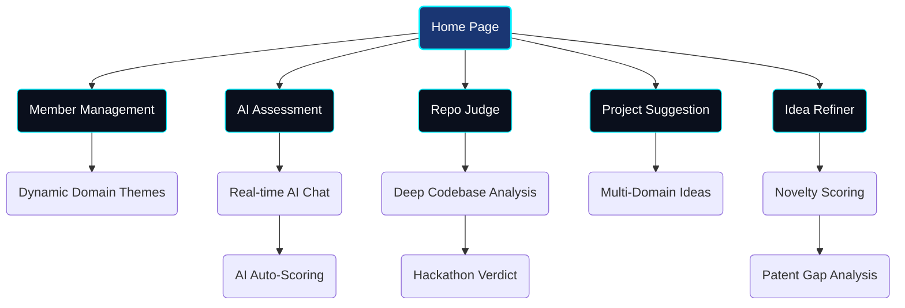
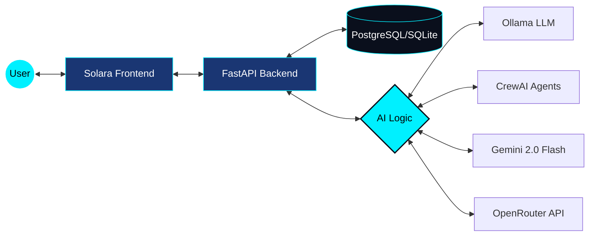

# 🧑‍🤝‍🧑 Group Maker

> An AI-powered platform to manage team members, run interactive skill assessments, and evaluate GitHub repositories — built with **FastAPI** + **Solara**.


---

## ✨ Features

| Feature | Description |
|---|---|
| 🏠 **Premium Home Page** | Landing page with highly creative glassmorphism flashcards, glowing orbs, and grid overlays |
| 👥 **Member Management** | Full CRUD for members with domain assignment. Dynamic themed UI that changes per skill domain |
| 💡 **Idea Refiner** | Patent-level gap analysis, novelty scoring (0-100), and technical refinement options |
| 🧑‍⚖️ **Repo Judge** | Submit any GitHub repo URL — AI performs deep codebase analysis and delivers a hackathon-style verdict with mentor feedback |
| 🧑‍💻 **Multi-Domain** | Comprehensive support for Web/App Dev, ML, AI, Cloud, and Cybersecurity across all features |
| 🌌 **Astonishing Dark Theme** | Seamless deep-dark aesthetic (#030812) with electric-blue text input and animated navigation |

### 🚀 Feature Flow



---

## 🎨 UI Showcase — Dynamic Domain Themes

The Members page features **7 unique visual themes** that change automatically when you select a domain:

| Domain | Theme | Accent |
|---|---|---|
| 🌐 All Domains | Dark Navy / Indigo | Cyan |
| 💻 Web Development | Matrix Green | Emerald |
| 📱 App Development | Purple Space | Violet + Orange |
| 🤖 Machine Learning | Robotic Steel | Teal / Cyan |
| 🧠 Agentic AI | Neon Futuristic | Hot Pink |
| ☁️ Cloud Computing | Sky Blue | Blue |
| 🔒 Cybersecurity | Hacker Terminal | Matrix Green |

**Visual effects include:** an animated black/blue navigation system with glowing cyan indicators, animated gradient backgrounds, electric blue input text fields, floating particles, shooting stars, grid overlays, glassmorphism cards, neon button glow pulses, custom gradient scrollbar, and hover lift animations—all seamlessly integrated into a premium, astonishing dark aesthetic.

---

## 🏗️ Project Structure

```
group_maker/
├── backend/
│   └── app/
│       ├── main.py                # FastAPI entry point + CORS config
│       ├── models.py              # SQLAlchemy models (Member, Domain, AssessmentSession)
│       ├── schemas.py             # Pydantic request/response schemas
│       ├── crud.py                # Database helpers
│       ├── database.py            # DB engine (PostgreSQL / SQLite fallback)
│       ├── routers/
│       │   ├── members.py         # CRUD endpoints for members & domains
│       │   ├── assessment.py      # AI assessment session endpoints
│       │   ├── repo_judge.py      # GitHub repo evaluation endpoint
│       │   ├── project_suggest.py # Endpoint for AI project suggestions
│       │   └── idea_validator.py  # AI Idea refinement and gap analysis
│       └── services/              # Business logic & AI service wrappers
│           └── llm_factory.py     # Hybrid LLM priority & fallback logic
├── solara_app/
│   ├── app.py                     # Solara app layout, routing & global CSS
│   ├── assets/
│   │   └── custom.css             # Global Vuetify overrides & glassmorphism
│   └── pages/
│       ├── home.py                # Landing page with interactive flashcards
│       ├── members.py             # Members UI — dynamic themed CRUD page
│       ├── assessment.py          # AI Assessment — setup → chat → results
│       ├── project_suggest.py     # Multi-domain project idea generation
│       ├── repo_judge.py          # Repo Judge — form → AI analysis → verdict
│       └── idea_refiner.py        # Patent-level idea validation & refinement
├── requirements.txt
├── render.yaml                # Render.com deployment blueprint
└── .env                       # Environment variables (not committed)
```

---

## ⚙️ Tech Stack

### 🛠️ Architecture



| Layer | Technology |
|---|---|
| **Backend** | FastAPI, SQLAlchemy, Pydantic |
| **Database** | PostgreSQL (Supabase) — auto-fallback to SQLite |
| **Frontend** | Solara (Python-native reactive UI) |
| **AI / LLM** | **Hybrid Model Factory** (Gemini 2.0 Flash via OpenRouter ↔️ Ollama Local) |
| **Agents** | CrewAI, LangChain |
| **Deployment** | Render.com (Blueprint via `render.yaml`) |

---

## 🚀 Getting Started (Local)

### 1. Clone & install

```bash
git clone https://github.com/keshavmishra27/group_maker.git
cd group_maker
python -m venv venv
venv\Scripts\activate        # Windows
pip install -r requirements.txt
```

### 2. Configure environment

Create a `.env` file in the project root:

```env
DATABASE_URL=postgresql://<user>:<password>@<host>:5432/<db>
OLLAMA_MODEL=qwen2.5:3b
OLLAMA_BASE_URL=http://localhost:11434
OPENROUTER_API_KEY=your_key_here
OPENROUTER_MODEL=google/gemini-2.0-flash-001
API_URL=http://localhost:8000
```

> **Tip:** Omit `DATABASE_URL` to auto-fallback to local SQLite (`group_maker.db`).

### 3. Pull the Ollama model

Make sure [Ollama](https://ollama.com/) is installed and running:

```bash
ollama pull qwen2.5:3b
```

### 4. Start the backend

```bash
uvicorn backend.app.main:app --reload --port 8000
```

- API: `http://localhost:8000`
- Docs: `http://localhost:8000/docs`

### 5. Start the frontend

```bash
solara run solara_app/app.py
```

- UI: `http://localhost:8765`

---

## 📡 API Endpoints

### Members

| Method | Endpoint | Description |
|---|---|---|
| `GET` | `/members/` | List all members (optional `?domain_id=`) |
| `GET` | `/members/domains` | List all domains |
| `GET` | `/members/by-domain` | Members grouped by domain |
| `POST` | `/members/` | Create a member with domain assignments |
| `POST` | `/members/bulk` | Bulk create members |
| `PUT` | `/members/{id}` | Update a member |
| `DELETE` | `/members/{id}` | Delete a member |

### Assessment

| Method | Endpoint | Description |
|---|---|---|
| `POST` | `/assess/start` | Start a new AI assessment session |
| `POST` | `/assess/chat` | Send a student message, get AI reply |
| `POST` | `/assess/score/{id}` | End session & get CrewAI-generated scores |
| `GET` | `/assess/domains` | List available assessment domains |

### Repo Judge

| Method | Endpoint | Description |
|---|---|---|
| `POST` | `/repo-judge/analyze` | Submit a GitHub repo for AI evaluation |


### Project Suggestion

| Method | Endpoint | Description |
|---|---|---|
| `POST` | `/project-suggest/suggest` | Get AI-generated project ideas for multiple domains |
| `GET` | `/project-suggest/health` | Project suggestion health check |
| `POST` | `/idea-validator/check` | Check idea similarity vs current market |
| `POST` | `/idea-validator/refine` | Get patent-level refinement & novelty scoring |


**Services deployed:**
- **`group-maker-api`** → FastAPI backend
- **`group-maker-ui`** → Solara frontend

**Required env vars (set in Render dashboard):**

| Variable | Service | Description |
|---|---|---|
| `DATABASE_URL` | API | PostgreSQL connection string |
| `OPENAI_API_KEY` | API | For AI features (if using OpenAI) |
| `VAPI_API_KEY` | API | Vapi calling agent key (optional) |
| `API_URL` | UI | Points to deployed backend URL |

---

## 🗄️ Database Models

| Model | Description |
|---|---|
| **`Member`** | Name, category (senior/intermediate/junior), linked domains |
| **`Domain`** | Skill domain (e.g. Web Dev, ML, Cybersecurity) |
| **`MemberDomain`** | Many-to-many join table |
| **`AssessmentSession`** | Student name, domains tested, chat transcript, scores, status |

<p align="center">
  Built with ❤️ by <a href="https://github.com/keshavmishra27">Keshav Mishra</a>
</p>
