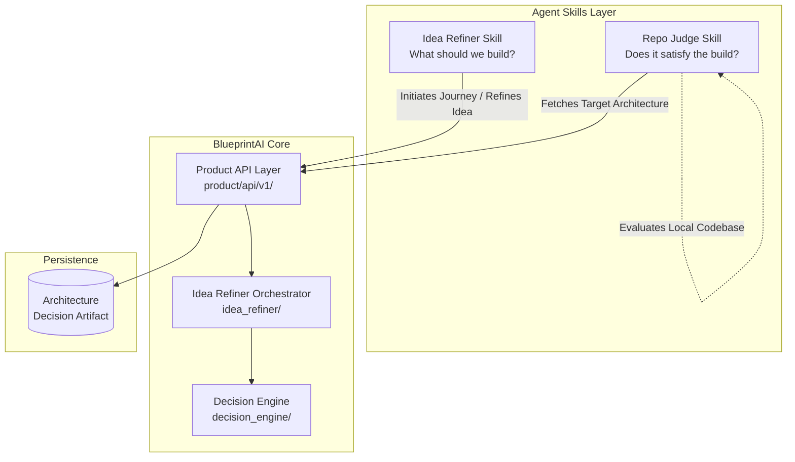

# BlueprintAI Architecture Map

## 1. Current Architecture Flow

Based on discovery of the `.agents` and root directories, the system currently consists of several disconnected vertical slices that replicate or bypass the core governance engine.

### The Agent Skills Layer (`.agents/skills/`)
1. **Idea Refiner Skill** (`.agents/skills/idea-refiner/`)
   - **Agent Interface:** Uses `agent_sim.py` and `run_experiments.py` to drive ideation.
   - **Backend:** Hosts a FastAPI server (`backend/main.py`) exposing `/api/journey/start` and `/api/journey/answer`.
   - **Integration:** Directly imports and consumes the root `decision_engine` structures (`decision_engine.tree`, `decision_engine.input_layer`) to drive the journey state machine.
   - **Frontend:** Has a dedicated React frontend.

2. **Repo Judge Skill** (`.agents/skills/repo-judge/`)
   - **Agent Interface:** Uses local terminal logic to gather deterministic evidence from the workspace.
   - **Backend:** Hosts an independent FastAPI server (`backend/main.py`) exposing `/api/analysis`. This endpoint purely accepts a generated `RepoJudgeAnalysisPayload`, calculates a score, and persists it. **It does not currently validate against a BlueprintAI architecture artifact.**
   - **Frontend:** Has a dedicated React frontend (`frontend/src/pages/ReportPage.tsx`, etc.) to visualize the scoring.

3. **BlueprintAI Skill** (`.agents/skills/blueprintai/`)
   - **Current Contribution:** Contains `client.py` and `SKILL.md`. It provides a thin Python HTTP wrapper around the `POST /api/v1/ideas/analyze` REST endpoint.

### The Core Engine Layer (Root)
1. **Decision Engine** (`decision_engine/`): The foundational logic layer (optimizer, tree structures, inputs, governance).
2. **Idea Refiner Core** (`idea_refiner/`): The deterministic Python orchestrator bridging NLP and the decision engine.
3. **Product API** (`product/`): A REST API layer (`product/api/v1/routes.py`) that wraps both `idea_refiner` and `repo_checker`, returning canonical `DecisionRecord` objects to the main application database.

---

## 2. Proposed Architecture Flow

In this model, the **Idea Refiner** and **Repo Judge** act as the primary agent-facing skills and user-facing UI visualization layers. They both consume the single, canonical **BlueprintAI Core** (which represents the REST API in `product/` and the underlying `decision_engine`).

### Skill Responsibilities in Proposed Flow:
- **Idea Refiner (`.agents/skills/idea-refiner/`)**: The agent focuses solely on interacting with the user, extracting requirements, and sending them to BlueprintAI core. The Idea Refiner frontend visualizes the resulting architecture, uncertainties, and decision trees produced by the core. It no longer imports `decision_engine` directly, but talks to the `product` REST API.
- **Repo Judge (`.agents/skills/repo-judge/`)**: The agent inspects the local codebase, fetches the canonical `DecisionRecord` from BlueprintAI core (via REST), compares the code against the architecture dependencies, and outputs evidence of gaps. The Repo Judge frontend visualizes these architectural gaps.

---

## 3. Redundancy of the `.agents/skills/blueprintai` Directory

**What it contributes:**
- A `SKILL.md` instructing an agent on how to call the engine.
- A `client.py` module for making HTTP `POST` requests to `/api/v1/ideas/analyze`.

**Why it is redundant:**
- **Routing:** The `idea-refiner` skill already exists to map raw ideas into architecture. The logic in `blueprintai/client.py` should simply be moved into `.agents/skills/idea-refiner` so that the Idea Refiner agent uses the `product` REST API rather than importing `decision_engine` locally.
- **Consumption:** The `repo-judge` skill already exists to perform repository evaluations. It just needs to fetch the output of the Idea Refiner via the same `product` API.
- **Duplication:** Adding a `blueprintai` skill creates a third, ambiguous entry point for agents ("Should I use Idea Refiner or BlueprintAI?"), violating the clear separation of concerns (Idea vs. Repository).

**Conclusion:** The `.agents/skills/blueprintai` directory can be safely deleted once its HTTP client logic is integrated into `idea-refiner` and `repo-judge`.
